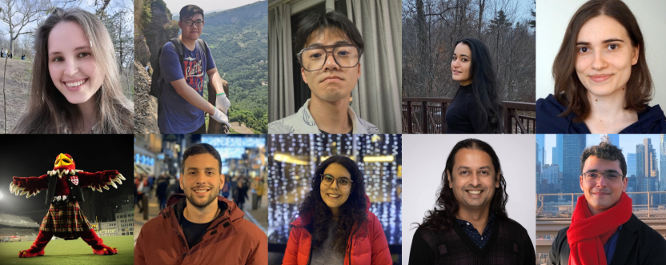

::: column-margin
**News**

**Jan 2023** - If you have programming skills,  are interested in a  paid summer internship (June-July-August), and are relatively new to open-source, get in touch - we may have 2 or more Google Summer of Code projects available.

**Jan 2023** - Yohai and Oren get VHRN recruitment awards. Congrats both !
  
**Jan 2023** - Kasia has been awarded a UNIQUE postdoctoral excellence fellowship !

**Jan 2023** - Yohai and Oren join the lab as new graduate students; Anais starts her undergraduate research course in the lab. Welcome !

**Nov 2022** - Amanda and Kasia present the first poster from the lab at the VHRN meeting in Montreal.

{fig-alt="Lab logo"}
:::

We work at the interface between the mind, brain, machines and the external world, using behavioral measurements (including eye-tracking), physiological measurements and computational modeling. We work with humans (and soon with animals, including non-human primates) as well as with open datasets, and much of our research focus is on vision, hearing and eye-movements, including both sensory, attentional and cognitive aspects. We keep a keen eye on direct applications to devices, algorithms and human health.

More details on the [Projects](projects.qmd) page.

[{fig-alt="Lab members" fig-align=left}](members.qmd)

