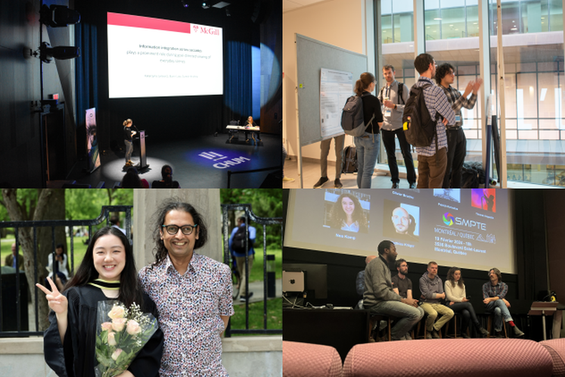
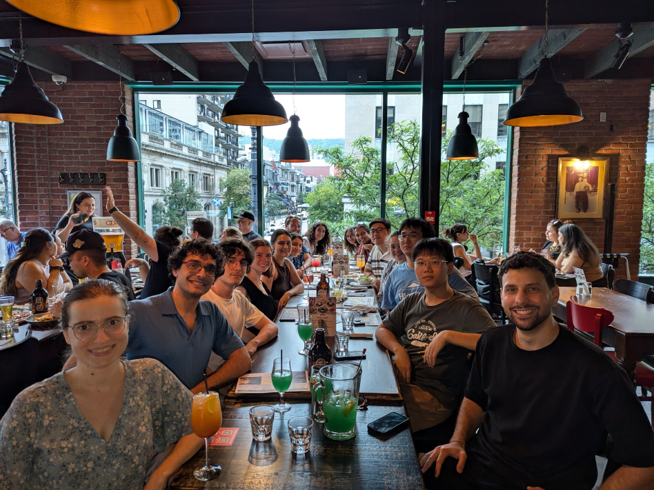

We work at the interface between the mind, brain, machines and the external world, using behavioral measurements (including eye tracking), physiological measurements and computational modeling. We work with humans and animals, as well as with open datasets, and much of our research focus is on vision, hearing and eye-movements, including sensory, attentional and cognitive aspects. We keep a keen eye on direct applications to devices, algorithms and human health.

More details on the [Projects](projects.qmd) page.

::: {layout-nrow="2"}
[{fig-alt="Lab Photo" fig-align=left}](members.qmd)
[{fig-alt="Lab Photo" fig-align=left}](members.qmd)
:::

[More photos](https://m2b3.github.io/members.html#us)

**News**

**April 2026** - Yohai gets a FRQNT Doctoral Research Fellowship, as well as a UNIQUE travel award to facilitate his travel to NYC for the CSHL AI in Biology symposium. Congrats Yohai !! 🎉

**April 2026** - Lab members will be part of the mentorship teams for 5 Google Summer of Code open-source projects through [INCF](https://www.incf.org/) this summer:

- iEEG - an intracranial EEG data analysis package in collaboration with the CHUM
- [SciCommons](https://alphatest.scicommons.org) - an open platform for scientific discussion and evaluation
- BreathState - a phone app for monitoring breathing, heart-rate and their relationship to mental health and performance
- ActiveVision - a package for modeling active vision
- GestureCap - a system for markerless, gesture-driven musical expression and other applications 

**April 2026** - Yohai gets a NSERC CGRS-D fellowship. Congrats Yohai !! 🎉

**April 2026** - Alex Zhao get a CIHR CGSM award and Yohai gets a UNIQUE PhD fellowship. Congrats Alex and Yohai !! 🎉

**March 2026** - Yohai's [CanVIT model](https://arxiv.org/abs/2603.22570) is now out as a preprint in arXiv !! 🎉📄

**March 2026** - ["Correction of saccadic decisions during active visual search in the monkey"](https://jov.arvojournals.org/article.aspx?articleid=2811630) in print at the Journal of Vision after a smooth, quick and transparent reviewing process. 📄

**February 2026** - Welcoming Eva Ozturk who comes to us from Paris and will spend a few months with us working on an epilepsy-related project.

**December 2025** - Alex gets a Brain-Heart Interconnectome Masters Scholarship ! 🎉

**December 2025** - SciCommons: The first step in our slow, but steady progress towards an open publishing and rating portal is out in the form of a [journal club portal](https://alphatest.scicommons.org/). Great work by Armaan and Faisal, building on past work by Jyothi Swaroop and Dinakar. Intrepid testers are welcome to set up their discussion groups there.

**December 2025** - Jonathan's preprint out on [biorXiv](https://www.biorxiv.org/content/10.1101/2025.11.26.690332v1) !! 📄

**November 2025** - Alex gets a VSRN recruitment award ! 🎉

**October 2025** - New preprint out on [arXiv](https://arxiv.org/abs/2510.25119) !! 📄

**September 2025** - A lot of movement, and new beginnings ! Oren and Noa graduate and move on to new things, Kasia moves to a new position in Krakow, MITACS and GSoC students return to their regular programs, Alex joins the lab as a new Masters student. Congratulations to all !! 🎉

**August 2025** - Maya gets a Jenny Panitch Beckow Memorial Scholarship. Congratulations !! 🎉

**August 2025** - Yohai gets a McGill Faculty of Medicine and Health Sciences Studentship. Congratulations ! 🎉

**May 2025** - Maya gets a Savoy Foundation Masters fellowship ! Congratulations !! 🎉

**April 2025** - New methods preprint out on microelectrode recordings in the human insula from the ongoing collaboration with Dr. Dang Nguyen's team at the CHUM. [Preprints.org](https://www.preprints.org/manuscript/202504.1279/v1) 📄 

**April 2025** - Amanda has finished her Masters and will move on from the lab at the end of the month. Congratulations on completing an excellent Masters thesis, and here is to new adventures ! 🎉

**April 2025** - Sabrina has been awarded a Summer 2025 NSERC Undergraduate Student Research Award to continue her ongoing work on modeling visual search.

**March 2025** - First paper out from the lab. Yohai's preprint showing, for the first time, how forward remapping can explain peri-saccadic biphasic mislocalization, will appear soon in the Journal of Vision after a smooth and constructive review process. Great work, Yohai ! 🎉📄

**March 2025** - New preprint out on variability in local field potentials from a fun collaboration with Mohsen Parto-Dezfouli and the extended group of Pascal Fries. [bioRxiv](https://www.biorxiv.org/content/10.1101/2025.03.27.645661v1) 📄

**January/February 2025** - Maya gets UNIQUE, PGSS, VSRN and GREAT travel awards to go to the MicMac iEEG recording workshop/conference in France in March. 

**January 2025** - Buxin gets a UNIQUE Excellence Scholarship. Congratulations, Buxin ! 🏆

**October 2024** - We get a CIRMMT Agile award for "Developing our new markerless, very short-latency, camera-based interface for musical expression". 🎉🎊🥳

**September 2024** - Amanda gets a GREAT travel award. Congratulations ! 🏆

**September 2024** - Maya and Yohai get VSRN Recruitment awards at the Masters and PhD level respectively. Congratulations ! 🏆

**September 2024** - Welcoming Maya (Masters) and Buxin (PhD) to the lab as new graduate students. 💐

**September 2024** - Welcoming Evan and Isidore to the lab as undergraduate research trainees. They will both do research courses with us for a year. 💐

**September 2024** - Yohai gets a VSRN Scientific Presentation and Training Award.  Congrats Yohai ! 🏆

**August 2024** - Oren gets the JCF Dr. Steven S. Zalcman Memorial Scholarship. Congrats Oren ! 🏆

**May 2024** - Welcoming Jacky and Alex to the lab as undergraduate research trainees. They will be with us for several months to a year. 💐

**April 2024** - Buxin and Haoxiang complete their Masters defense with flying colors. Alexandru, Youzhi, Lilia and Romina complete their year-long research courses. Yohai's team wins third prize in the Mistral AI hackathon in Paris during the R.AI.SE summit.

**March 2024** - Both Oren's team and Noa's team get CIRMMT Student Awards (at the maximum level). Congrats Oren and Noa ! 🏆

**March 2024** - Yohai gets accepted to and will attend the CIFAR Deep Learning + Reinforcement Learning (DLRL) Summer School. Congrats Yohai ! 🏆

**March 2024** - Welcoming Louis to the lab as a computer vision and neuro-AI intern from Telecom Paris (until August 2024). :tada: 

**February 2024** - Welcoming Lilie, Joshua and Pauline, our new musically-oriented members/collaborators. :tada: 

**February 2024** - Yohai gets a CAMBAM Masters Fellowship for this year, to add to his UNIQUE Fellowship. Congrats Yohai ! 🏆

**February 2024** - A warm welcome to Jerome, our new, but experienced Research Associate. :tada:

**January 2024** - Amanda gets a CGSM award ! Congrats Amanda! 🏆

**January 2024** - Yohai has smooothly and successfully completed his PhD fast-track seminar and will formally become a PhD student from September (after immigration formalities). Congrats Yohai!

**January 2024** - Kasia receives a UNIQUE travel award to attend the Vision Sciences Society meeting this summer in Florida. Congrats Kasia! 🏆

**December 2023** - Yohai gets a UNIQUE Excellence Scholarship (Level: Masters). Congrats Yohai ! 🏆

**October 2023** - Kasia gets a best poster award at the UNIQUE Neuro-AI meeting in Mont-Tremblant. Congrats Kasia! 🏆

**September 2023** - More [preprints](output.qmd) out ! Congrats Yohai. 📄

**September 2023** - Noa gets a VHRN recruitment award. Congrats Noa! 🏆

**September 2023** - Welcoming Noa (Masters), Alexandru and Lilia (NSCI 410), Youzhi (PSYC 494), and Romina (COGS 401) to the lab. :wave:

**August 2023** - The first set of lab [preprints](output.qmd) is out ! Congrats Kasia and Buxin. 📄

**August 2023** - Oren has won the Jenny Panitch Beckow Memorial Scholarship (CAD 20,000) for his musical absorption project. Congrats Oren ! 🏆

**July 2023** - Yohaï and the team he led [won the AI Safety Hackathon](https://www.linkedin.com/posts/entrepreneur-first_last-night-marked-the-conclusion-of-our-ai-activity-7084967819297087488-b-DN?utm_source=share&utm_medium=member_desktop) organized by Meta AI and Entrepreneur First at Meta's Paris office. 🏆

**June 2023** - Alexandru, Bradley, Yavuz, Lilia, and Youzhi join the lab as summer interns. Alexandru and Youzhi will do 2-semester research courses with us (NSCI 410 and PSYC 494) after that until Summer 2024. :wave:

**May 2023** - Kasia has been awarded a VHRN Scientific Presentation and Training award. 🏆

**Mar 2023** - The team of Anais, Amanda, Yohai and Ula has been awarded a CIRMMT student award to work on their music performance project. 🏆

**Jan 2023** - If you have programming skills,  are interested in a  paid summer internship (June-July-August), and are relatively new to open-source, get in touch - we may have 2 or more [Google Summer of Code projects](projects.qmd){#google-summer-of-code-2023} available.

**Jan 2023** - Yohai and Oren get VHRN recruitment awards. Congrats both! 🏆
  
**Jan 2023** - Kasia has been awarded a UNIQUE postdoctoral excellence fellowship! 🏆

**Jan 2023** - Yohai and Oren join the lab as new graduate students; Anais starts her undergraduate research course in the lab. Welcome! :wave:

**Nov 2022** - Amanda and Kasia present the first poster from the lab at the VHRN meeting in Montreal. 🏆

{fig-alt="Lab logo"}

-------------------------------

