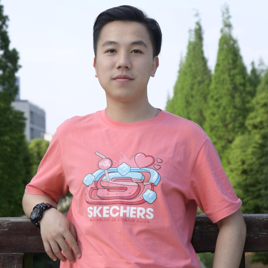

---
execute:
  echo: false
  freeze: auto
knitr:
  opts_chunk: 
    collapse: true
    results: false
---

### Current Lab Members

::: column-margin
Marty's image is from the [McGill Tribune](https://tinyurl.com/55wf3bae).
:::

::: {#members layout-ncol="5"}
[{fig-alt="Photo of Suresh"}](#suresh)

[{fig-alt="Photo of Kasia"}](#kasia)

[{fig-alt="Photo of Yohai"}](#yohai)

[{fig-alt="Photo of Amanda"}](#amanda)

[{fig-alt="Photo of Haoxiang"}](#haoxiang)

[{fig-alt="Photo of Oren"}](#oren)

[{fig-alt="Photo of Buxin"}](#buxin)

[{fig-alt="Photo of Anais"}](#anais)

[{fig-alt="Photo of Injy"}](#injy)

[{fig-alt="Photo of Chen"}](#chen)
:::

<!-- ### Current undergraduate observers -->

<!-- ::: {layout-ncol="5"} -->


<!-- ::: -->

------------------------------------------------------------------------

<a name="suresh"></a>

#### Suresh Krishna

::: column-margin
{fig-alt="Photo of Suresh" width="200"}
:::

-   Associate Professor, Department of Physiology, McGill.

-   MBBS (Med School), AIIMS, New Delhi; PhD, NYU, New York.

-   Spent time at Columbia University, CNRS (Lyon), German Primate Center (Goettingen), MPI for Human Development (Berlin), before coming to McGill (Jan 2020).

-   [Email](mailto:suresh.krishna@mcgill.ca); Personal web-page: TBA; [Google Scholar](https://tinyurl.com/48dfzjuk)

------------------------------------------------------------------------

<a name="kasia"></a>

#### Katarzyna (Kasia) Jurewicz

::: column-margin
{fig-alt="Photo of Kasia" width="200"}
:::

-   Post-doctoral fellow, Department of Physiology, McGill.
-   MSc in Psychology, University of Warsaw; PhD in Neurobiology, Nencki Institute of Experimental Biology, Polish Academy of Sciences, Warsaw.
-   Previously, I was a post-doc in Dr. Becket Ebitz' lab (Noise lab) at Université de Montréal. Earlier, I conducted research in Dr. Ewa Kublik's Cortico-Thalamic Group at the Nencki Institute of Experimental Biology. My PhD work was supervised by Prof. Andrzej Wróbel in the Laboratory of the Visual System at Nencki.
-   [Email](mailto:katarzyna.jurewicz@mcgill.ca); Personal web-page: TBA; [Google Scholar](http://www.tinyurl.com/kjurewicz-scholar)

------------------------------------------------------------------------

<a name="yohai"></a>

#### Yohaï-Eliel Berreby

::: column-margin
{fig-alt="Photo of Yohai" width="200"}
:::

-   M.Sc. student, Department of Physiology, McGill
-   *Diplôme d'Ingénieur* (combined B.Sc. and M.Sc. in Engineering), Télécom Paris, Palaiseau, France
-   MPSI/MP CPGE (Math/Physics [*Classes Préparatoires aux Grandes Écoles*](https://en.wikipedia.org/wiki/Classe_pr%C3%A9paratoire_aux_grandes_%C3%A9coles)), Lycée Hoche, Versailles, France
-   [Email](mailto:yohai-eliel.berreby@mail.mcgill.ca), [GitHub](https://github.com/yberreby/), [LinkedIn](https://linkedin.com/in/yberreby)

------------------------------------------------------------------------

<a name="amanda"></a>

#### Amanda Pruss

* M.Sc. Student, Integrated Program in Neuroscience, McGill.
* B.A. in Psychology, McGill.
* I am also very interested in applying my knowledge in neuroscience in a clinical setting as well, in an effort to help people with conditions related to vision, attention, or epilepsy.
* [Email](mailto: amanda.pruss@mail.mcgill.ca), [GitHub](https://github.com/amandapruss), [LinkedIn](https://www.linkedin.com/in/amanda-pruss-a78813261/)

------------------------------------------------------------------------

<a name="haoxiang"></a>

#### Haoxiang Liu

::: column-margin
{fig-alt="Photo of Haoxiang" width="200"}
:::

-   M.Sc. Student, Department of Physiology, McGill.
-   M.Eng. Student, Biomedical Engineering, University of Electronic Science and Technology of China, Chengdu, China.
-   B.Eng. in Network Engineering, University of Electronic Science and Technology of China, Chengdu, China.
-   [Email](mailto:haoxiang.liu@mail.mcgill.ca), [GitHub](https://github.com/hxliu4mcgill)

------------------------------------------------------------------------

<a name="oren"></a>

#### Oren Gurevitch

::: column-margin
{fig-alt="Photo of Oren" width="200"}
:::

-   M.Sc. Student, Department of Physiology, McGill.
-   B.Sc. in Neuroscience, Bar-Ilan University, Ramat Gan, Israel.
-   Previously, I was a research assistant working on sensory processing using rats, at Bar-Ilan University under Professor Adam Zaidel. Before that, as a lab assistant at the Weizmann Institute of Science, I worked on Multiple Sclerosis research with Professor Idit Shachar.
-   [Email](mailto:oren.gurevitch@mail.mcgill.ca), [GitHub](https://github.com/OrenGurevitch), [LinkedIn](https://www.linkedin.com/in/oren-gurevitch/)

------------------------------------------------------------------------

<a name="buxin"></a>

#### Buxin Liao

::: column-margin
{fig-alt="Photo of Buxin" width="200"}
:::

-   M.Sc. Student, Department of Physiology, McGill.
-   M.Eng. Student, Biomedical Engineering, University of Electronic Science and Technology of China, Chengdu, China.
-   B.Eng. in Biomedical Engineering, Southeast University, Nanjing, China.
-   [Email](mailto:buxin.liao@mail.mcgill.ca), [GitHub](https://github.com/D-Fonauton)

-------------------------------------------

<a name="anais"></a>

#### Anais Rubsamen

::: column-margin
{fig-alt="Photo of Anais" width="200"}
:::

* B.A. Psychology student, McGill University
* Over the short term, I wish to master software, technologies and techniques used in Psychology research and treatments, with a special focus on Python and R. Over the long term, I wish to develop strategies to improve the care of people living with psychopathologies and chronic pain, with a special focus on BPD.
* [Email](mailto:%20anais.rubsamen@mail.mcgill.ca), [LinkedIn](https://www.linkedin.com/in/anaïs-issaeva-rubsamen-9ba222217/) 

------------------------------------------------------

<a name="chen"></a>

#### Chen Liu

::: column-margin
{fig-alt="Photo of Chen" width="200"}
:::

<!--#
* B.Sc. Physiology student minoring in computer science, McGill University
* I worked with the NWB dataset on memory under the supervision of Dr. Krishna, and I am very interested in gaining more knowledge in the field of both computational and clinical neuroscience.
* [Email](mailto:%20pegah.aghili@mail.mcgill.ca)
--> 

* M.Sc. Student, Integrated Program in Neuroscience, McGill.
* M.Eng. Student, Biomedical Engineering, University of Electronic Science and Technology of China, Chengdu, China.
* B.A. in Environmental Engineering, Notheastern University, China
* I am interested in EEG technology's development and BCI methods' research
* [Email](mailto:chen.liu6@mail.mcgill.ca)

-------------------------

<a name="injy"></a>

#### Injy Fouda


::: column-margin
{fig-alt="Photo of Injy" width="200"}
:::

* B.A. Sc Cognitive Science student Neuroscience stream with a minor in interdisciplinary life sciences, McGill University.
* [Email](mailto:%20injy.fouda@mail.mcgill.ca); [LinkedIn](https://www.linkedin.com/in/injy-fouda-975b98179/)

------------------------------------------------------------------------

### Where we are from

```{r,message=FALSE}
library(tmap)
library(sf)

data("World")

lat <- c(8.561259, 30.605053,32.082330,43.6532,53.13333,43.70313,48.831704,30.0444)
lon <- c(76.874224, 104.074123,34.881787,-79.3832,23.16433,7.26608,1.609642,31.2357)
namez <- c('Suresh','Haoxiang','Oren','Amanda','Kasia','Anais','yohai','injy')
memberz<-data.frame(namez,lat,lon)
geocode <- data.frame(lon,lat)
geocode2 <- st_as_sf(geocode, coords = c("lon", "lat"), crs = 4326)

# tm_shape(World) +
#     tm_fill("lightblue",alpha=1,minimize=TRUE) +
#   tm_layout(bg.color = "black") +
# tm_shape(geocode2) +      # dots shape
#   tm_dots(col = "red", size = .2)

tm_shape(World)+
  tm_fill(col='darkslategray2')+
  tm_borders(col="black")+
  tm_layout(scale=0.5, bg.color="dodgerblue4",inner.margin=0.0005)+
  tm_shape(geocode2)+
  tm_dots(size = 1, col = "firebrick1")+
  tm_layout()+
     tm_credits("Made using tmap",
             position = c("RIGHT", "BOTTOM"))
```

### Alumni

-   PHGY 396 - Sean Solomon, Sarah Beydoun, Pegah Aghili
-   COMP 401 - Nevine Nzabonimpa
-   Mackey-Glass research bursary -- Tim Yang
-   Undergraduate observers - Caden Welch, Max Tweedale, Elisa Niunin
