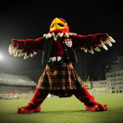
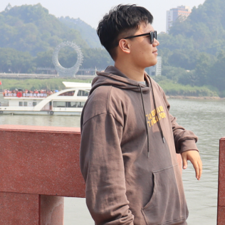
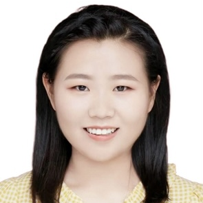
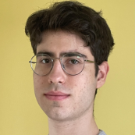
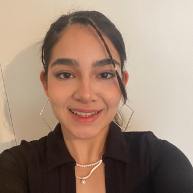
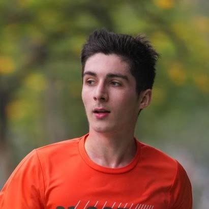
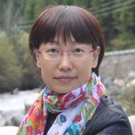

---
execute:
  echo: false
  freeze: auto
knitr:
  opts_chunk: 
    collapse: true
    results: false
    warnings: false
---

### Current Lab Members

::: column-margin
Marty's image is from the [McGill Tribune](https://tinyurl.com/55wf3bae).
:::

::: {#members layout-ncol="6"}
[{fig-alt="Photo of Suresh"}](#suresh)

[{fig-alt="Photo of Kasia"}](#kasia)

[{fig-alt="Photo of Jerome"}](#jerome)

[{fig-alt="Photo of Yohai"}](#yohai)

[{fig-alt="Photo of Marty"}](#amanda)

[{fig-alt="Photo of Haoxiang"}](#haoxiang)

[{fig-alt="Photo of Oren"}](#oren)

[{fig-alt="Photo of Buxin"}](#buxin)

[{fig-alt="Photo of Noa"}](#noa)

[{fig-alt="Photo of Xinning"}](#xinning)

[{fig-alt="Photo of Sizhuo"}](#sizhuo)

[{fig-alt="Photo of Anais"}](#anais)

[{fig-alt="Photo of Youzhi"}](#youzhi)

[{fig-alt="Photo of Alexandru"}](#alexandru)

[{fig-alt="Photo of Bradley"}](#bradley)

[{fig-alt="Photo of Marty"}](#lilia)

[{fig-alt="Photo of Romina"}](#romina)

[{fig-alt="Photo of Lilie"}](#lilie)

[{fig-alt="Photo of Louis"}](#Louis)

:::

[comm1]: # (### Current undergraduate observers) 
[comm2]: # (::: {#observers layout-ncol="5"})
[comm3]: # ([{fig-alt="Photo of Yavuz"}](#yavuz))
[comm4]: # (:::)
[comm5]: # ### Google Summer of Code Interns


### Collaborators

::: {#members layout-ncol="5"}
[{fig-alt="Photo of Chris"}](https://www.mcgill.ca/neuro/christopher-pack-phd)

[{fig-alt="Photo of Emmanuel"}](https://www.janelia.org/people/ifedayo-emmanuel-adeyefa-olasupo)

[{fig-alt="Photo of Catherine"}](https://www.mcgill.ca/sis/people/faculty/guastavino)

[{fig-alt="Photo of Fabrice"}](https://www.mcgill.ca/music/fabrice-marandola)

[{fig-alt="Photo of Simone"}](https://brams.org/members/simone-dalla-bella/)

[{fig-alt="Photo of Hongmei"}](https://www.neuro.uestc.edu.cn/vccl/yhm.html)

[{fig-alt="Photo of Dang Nguyen"}](https://neurosciences.umontreal.ca/recherche/les-chercheurs/dang-khoa-nguyen/)

[{fig-alt="Photo de Pauline"}](https://www.pauline-patie.com/)

[{fig-alt="Photo of MH"}](https://www.mcgill.ca/spot/marie-helene-boudrias)

[{fig-alt="Photo de Joshua"}](https://www.linkedin.com/in/joshua-rosner-98b15b166/?originalSubdomain=ca)

::: 

------------------------------------------------------------------------

<a name="suresh"></a>

#### Suresh Krishna

::: column-margin
{fig-alt="Photo of Suresh" width="200"}
:::

-   Associate Professor, Department of Physiology, McGill.

-   MBBS (Med School), AIIMS, New Delhi; PhD, NYU, New York.

-   Spent time at Columbia University, CNRS (Lyon), German Primate Center (Goettingen), MPI for Human Development (Berlin), before coming to McGill (Jan 2020).

-   [Email](mailto:suresh.krishna@mcgill.ca); [Google Scholar](https://tinyurl.com/ypeu5ha3)

------------------------------------------------------------------------

<a name="kasia"></a>

#### Katarzyna (Kasia) Jurewicz

::: column-margin
{fig-alt="Photo of Kasia" width="200"}
:::

-   Post-doctoral fellow, Department of Physiology, McGill.
-   MSc in Psychology, University of Warsaw; PhD in Neurobiology, Nencki Institute of Experimental Biology, Polish Academy of Sciences, Warsaw.
-   Previously, I was a post-doc in Dr. Becket Ebitz' lab (Noise lab) at Université de Montréal. Earlier, I conducted research in Dr. Ewa Kublik's Cortico-Thalamic Group at the Nencki Institute of Experimental Biology. My PhD work was supervised by Prof. Andrzej Wróbel in the Laboratory of the Visual System at Nencki.
-   [Email](mailto:katarzyna.jurewicz@mcgill.ca); [Google Scholar](http://www.tinyurl.com/kjurewicz-scholar)

------------------------------------------------------------------------


<a name="jerome"></a>

#### Jerome Carriot

::: column-margin
{fig-alt="Photo of Jerome" width="200"}
:::

-   Research Associate, Department of Physiology, McGill.
-   PhD, Joseph Fourier University, Grenoble, France.
-   For the past two decades, I have been working on the vestibular system. I have held positions as a postdoctoral researcher and research associate at several institutions, including Brandeis University in Boston, the University of Western Ontario in London, and McGill University. My specialization lies in neural encoding of self-motion within the vestibular pathway.
-   [Email](mailto:Jerome.carriot@mcgill.ca); [Google Scholar](https://scholar.google.ca/citations?hl=en&user=rEzMXEUAAAAJ); [ResearchGate](https://www.researchgate.net/profile/Jerome-Carriot)

--------------------------------------------------------------------------

<a name="yohai"></a>

#### Yohaï-Eliel Berreby

::: column-margin
{fig-alt="Photo of Yohai" width="200"}
:::

-   M.Sc. student, Department of Physiology, McGill
-   *Diplôme d'Ingénieur* (combined B.Sc. and M.Sc. in Engineering), Télécom Paris, Palaiseau, France
-   MPSI/MP CPGE (Math/Physics [*Classes Préparatoires aux Grandes Écoles*](https://en.wikipedia.org/wiki/Classe_pr%C3%A9paratoire_aux_grandes_%C3%A9coles)), Lycée Hoche, Versailles, France
-   [Email](mailto:yohai-eliel.berreby@mail.mcgill.ca), [GitHub](https://github.com/yberreby/), [LinkedIn](https://linkedin.com/in/yberreby)

------------------------------------------------------------------------

<a name="amanda"></a>

#### Amanda Pruss

* M.Sc. Student, Integrated Program in Neuroscience, McGill.
* B.A. in Psychology, McGill.
* I am also very interested in applying my knowledge in neuroscience in a clinical setting as well, in an effort to help people with conditions related to vision, attention, or epilepsy.
* [Email](mailto: amanda.pruss@mail.mcgill.ca), [GitHub](https://github.com/amandapruss), [LinkedIn](https://www.linkedin.com/in/amanda-pruss-a78813261/)

------------------------------------------------------------------------

<a name="haoxiang"></a>

#### Haoxiang Liu

::: column-margin
{fig-alt="Photo of Haoxiang" width="200"}
:::

-   M.Sc. Student, Integrated Program in Neuroscience, McGill.
-   M.Eng. Student, Biomedical Engineering, University of Electronic Science and Technology of China, Chengdu, China.
-   B.Eng. in Network Engineering, University of Electronic Science and Technology of China, Chengdu, China.
-   [Email](mailto:haoxiang.liu@mail.mcgill.ca), [GitHub](https://github.com/hxliu4mcgill)

------------------------------------------------------------------------

<a name="oren"></a>

#### Oren Gurevitch

::: column-margin
{fig-alt="Photo of Oren" width="200"}
:::

-   M.Sc. Student, Department of Physiology, McGill.
-   B.Sc. in Neuroscience, Bar-Ilan University, Ramat Gan, Israel.
-   Previously, I was a research assistant working on sensory processing using rats, at Bar-Ilan University under Professor Adam Zaidel. Before that, as a lab assistant at the Weizmann Institute of Science, I worked on Multiple Sclerosis research with Professor Idit Shachar.
-   [Email](mailto:oren.gurevitch@mail.mcgill.ca), [GitHub](https://github.com/OrenGurevitch), [LinkedIn](https://www.linkedin.com/in/oren-gurevitch/)

------------------------------------------------------------------------

<a name="buxin"></a>

#### Buxin Liao

::: column-margin
{fig-alt="Photo of Buxin" width="200"}
:::

* M.Sc. Student, Integrated Program in Neuroscience, McGill.
* M.Eng. Student, Biomedical Engineering, University of Electronic Science and Technology of China, Chengdu, China.
* B.Eng. in Biomedical Engineering, Southeast University, Nanjing, China.
* [Email](mailto:buxin.liao@mail.mcgill.ca), [GitHub](https://github.com/D-Fonauton)

-----------------------------------------------------------

<a name="noa"></a>

#### Noa Kemp

::: column-margin
{fig-alt="Photo of Noa" width="200"}
:::

* M.Sc. Student, Department of Physiology, McGill.
* B.Sc. in Biology and Computer Science, McGill.
* Between musical theater, computer science and the brain - I wasn’t able to chose so I will focus on one of their intersections: the study of audiovisual space and object perception.
* I was born and raised in Belgium. However half of my family lives in Israel and I have spent most of my summers there. Today, the place I truly call home is definitely Montreal.
* [Email](mailto:noa.kemp@mail.mcgill.ca)

------------------------------------------------------------------

<a name="xinning"></a>

#### Xinning Le

::: column-margin
{fig-alt="Photo of Xinning" width="200"}
:::

* M.Sc. Student, Integrated Program in Neuroscience, McGill.
* M.Eng. Student, Biomedical Engineering, University of Electronic Science and Technology of China, Chengdu, China.
* B.Sc. in Information Security, Xi'an University of Posts and Telecommunication, Xian, China.
* [Email](mailto:xinning.le@mail.mcgill.ca)

------------------------------------------------------------------

<a name="sizhuo"></a>

#### Sizhou Wang

::: column-margin
{fig-alt="Photo of Sizhuo" width="200"}
:::

* M.Sc. Student, Integrated Program in Neuroscience, McGill.
* M.Eng. Student, Biomedical Engineering, University of Electronic Science and Technology of China, Chengdu, China.
* B.Eng. in Biomedical Engineering, Taiyuan University of Technology, Taiyuan, China 
* My research interests lie in developing algorithmic encoding and decoding models to explore the intricate mechanisms of brain, particularly in the field of visual perception. 
* [Email](mailto:sizhuo.wang@std.uestc.edu.cn)

------------------------------------------------------------------

<a name="alexandru"></a>

#### Alexandru Tecu

::: column-margin
{fig-alt="Photo of Alexandru" width="200"}
:::

* B.A. Sc Neuroscience student, McGill University.
* Currently completing my degree under the Neurophysiology/Neural Computational stream
* [Email](mailto:alexandru.tecu.0@gmail.com)

------------------------------------------------------------------

<a name="romina"></a>

#### Romina Niksirat

::: column-margin
{fig-alt="Photo of Alexandru" width="200"}
:::

* B.A cognitive science student, McGill university
* I’m currently getting trained to start my independent research project in the lab.
* I am interested in intersections between neuroscience and psychology. My ultimate career goal is to combine my love for children and my knowledge in neuroscience to work with children with neurological disorders.
* [Email](mailto: romina.niksirat@mail.mcgill.ca), [LinkedIn](https://www.linkedin.com/in/romina-niksirat-4b628a278/)

-----------------------------------------------------------

<a name="youzhi"></a>

#### Youzhi Huang

::: column-margin
{fig-alt="Photo of Youzhi" width="200"}
:::

* B.Sc. Student, Department of Psychology, McGill. 
* I am interested in the cognition aspect, it provides valuable insights into the workings of the human mind, explaining behavior, informing interventions, and advancing our understanding of various cognitive processes. 
* [Email](mailto:youzhi.huang@mail.mcgill.ca)

---------------------------------------------------------

<a name="bradley"></a>

#### Bradley Austin-Keiller

::: column-margin
{fig-alt="Photo of Bradley" width="200"}
:::

* GrDip Music Therapy Student, Department of Fine Arts, Concordia 
* Joint B.A. in Psychology and Music, McGill 
* Combining a decade of musical training with clinical experience in a therapeutic context,  I strive to bridge the gap by examining neural and physiological correlates of music therapy with a special focus on the intersection of music and health promotion. 
* [Email](mailto:Bradleyaustinkeiller@videotron.ca), [LinkedIn](https://www.linkedin.com/in/bradley-austin-keiller-297787212/)

---------------------------------------------------------

<a name="anais"></a>

#### Anais Rubsamen

::: column-margin
{fig-alt="Photo of Anais" width="200"}
:::

* B.A. Psychology student, McGill University
* Over the short term, I wish to master software, technologies and techniques used in Psychology research and treatments, with a special focus on Python and R. Over the long term, I wish to develop strategies to improve the care of people living with psychopathologies and chronic pain, with a special focus on BPD.
* [Email](mailto:anais.rubsamen@mail.mcgill.ca), [LinkedIn](https://www.linkedin.com/in/anaïs-issaeva-rubsamen-9ba222217/) 

---------------------------------------------------------


<a name="lilia"></a>

#### Lilia Fernane

* U3 Neuroscience student, McGill University
* [Email](mailto:lilia.fernane@mail.mcgill.ca)

------------------------------------------------------------------------


<a name="lilie"></a>

#### Lilie Jeanneaux

* B. Eng. Civil engineering student, McGill University
* PCSI CPGE (Physics/Chemistry Classes Préparatoires aux Grandes Écoles), Lycée Louis-le-Grand, Paris, France
* I would like to continue my studies in the domain of environmental engineering. I'm also passionate about music.
* [Email](mailto:lilie.jeanneaux@mail.mcgill.ca)

------------------------------------------------------------------------

<a name="Louis"></a>

#### Louis Martinez

::: column-margin
{fig-alt="Photo of Louis" width="200"}
:::

* Engineering Student, Télécom Paris, Palaiseau, France
* MPSI/PSI CPGE (Math/Physics/Engineering Classes Préparatoires aux Grandes Écoles), Lycée Fénélon Sainte-Marie, Paris, France
* Passionate about AI and curious about how the brain works, I'm interested in the intersection between these two fields.
* A great deal of my free time is devoted to sport (running on the slopes of Mount Royal is my second passion) and travels.
* [Email](mailto:louis.martinez@telecom-paris.fr), [Github](https://github.com/lmartinez2001/),[LinkedIn](https://www.linkedin.com/in/louis-martinez-5586b71b7/)

------------------------------------------------------------------------


### Where we are from

<span style="color:firebrick1;">Current</span> /  <span style="color:orange;">Past</span>

```{r,message=FALSE,warning=FALSE}
#| warning: false
library(tmap)
library(sf)

data("World")

latlist <- c(8.561259, 30.605053,32.082330,43.6532,53.13333,43.70313,48.831704,30.0444,41.084148,37,45.45778,45.56583,50.848383801134766,45.5019,33.885340,32.3274,14.6584,32.4279,37.8706,50.6,45.25,48.84674234948124)
lonlist <- c(76.874224, 104.074123,34.881787,-79.3832,23.16433,7.26608,1.609642,31.2357,29.035460,3,-73.88489,-73.31437,4.350009489440508,-73.567,35.511500,50.8650,100.3947,53.6880,112.5486,3,5.75,2.3724100000000004)
 

namezlist <- c('Suresh','Haoxiang','Oren','Amanda','Kasia','Anais','Yohai','Injy','Yavuz','Lilia','Alexandru','Youzhi','Noa','Bradley','Sarah','Pegah','Divi','Romina','Sizhuo','Lilie','Jerome','Louis')


nowies<-is.element(namezlist,c('Suresh','Haoxiang','Oren','Amanda','Kasia','Anais','Yohai','Lilia','Alexandru','Youzhi','Noa','Bradley','Romina','Sizhuo','Lilie','Jerome','Louis'))
oldies<-is.element(namezlist,c('Injy','Sarah','Pegah','Yavuz','Divi'))

lat<-latlist[nowies]
lon<-lonlist[nowies]

latold<-latlist[oldies]
lonold<-lonlist[oldies]

geocode <- data.frame(lon,lat)
geocode2 <- st_as_sf(geocode, coords = c("lon", "lat"), crs = 4326)

ogeocode <- data.frame(lonold,latold)
ogeocode2 <- st_as_sf(ogeocode, coords = c("lonold", "latold"), crs = 4326)

# tm_shape(World) +
#     tm_fill("lightblue",alpha=1,minimize=TRUE) +
#   tm_layout(bg.color = "black") +
# tm_shape(geocode2) +      # dots shape
#   tm_dots(col = "red", size = .2)

usesize<-0.5

tm_shape(World)+
  tm_fill(col='darkslategray2')+
  tm_borders(col="black")+
  tm_layout(scale=0.5, bg.color="dodgerblue4",inner.margin=0.0005)+
  tm_shape(ogeocode2)+
  tm_dots(size = usesize, col = "orange")+
  tm_shape(geocode2)+
  tm_dots(size = usesize, col = "firebrick1")+
  tm_layout()+
     tm_credits("Réalisée avec tmap",
             position = c("RIGHT", "BOTTOM"))
```

### Alumni

-   PHGY 396 - Sean Solomon, Sarah Beydoun, Pegah Aghili
-   COMP 401 - Nevine Nzabonimpa
- 	COGS 444 Injy Fouda
-	PSYC 395 Anais Rubsamen 
-   Mackey-Glass research bursary -- Tim Yang
-   Undergraduate observers - Caden Welch, Max Tweedale, Elisa Niunin, Yavuz Shahzad, Divi Maheshwari
-   Google Summer of Code interns - Dinesh Sathiaraj, Ioannis Valasakis, Prakanshul Saxena, Abhinav Venkatadri, Somnath Sharma, Jyothi Swaroop Reddy Bommareddy, Soham Mulye

--------------------------------------------------

### Us

::: {#photos layout-ncol="2"}

{fig-alt="lab1"}

{fig-alt="lab2"}

{fig-alt="lab2"}

{fig-alt="lab2"}

{fig-alt="labgath"}

:::
