---
execute:
  echo: false
  freeze: auto
knitr:
  opts_chunk: 
    collapse: true
    results: false
    warnings: false
---

### Current Lab Members

::: column-margin
Marty's image is from the [McGill Tribune](https://tinyurl.com/55wf3bae).
:::

::: {#members layout-ncol="6"}
[{fig-alt="Photo of Suresh Krishna"}](#suresh)

[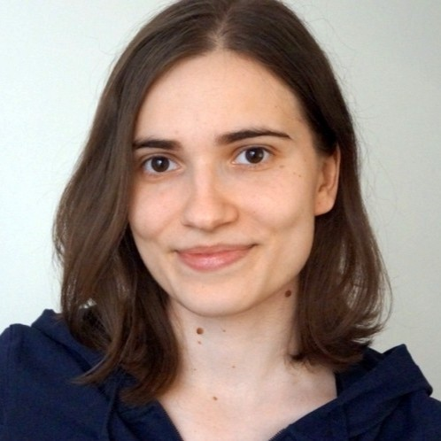{fig-alt="Photo of Katarzyna (Kasia) Jurewicz"}](#kasia)

[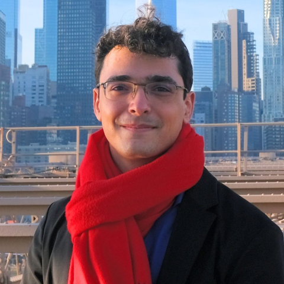{fig-alt="Photo of Yohai-Eliel Berreby"}](#yohai)

[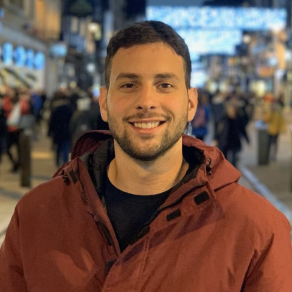{fig-alt="Photo of Oren Gurevitch"}](#oren)

[{fig-alt="Photo of Buxin Liao"}](#buxin)

[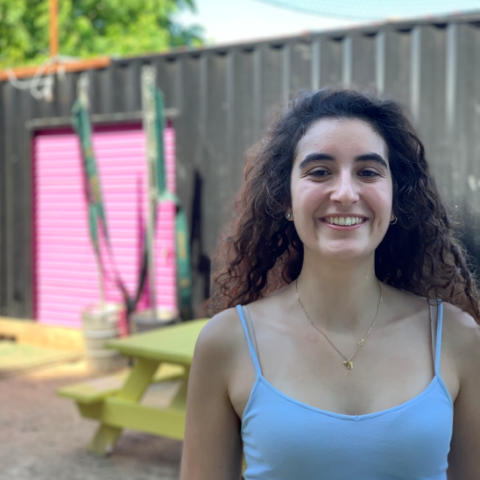{fig-alt="Photo of Noa Kemp"}](#noa)

[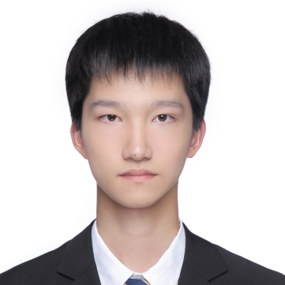{fig-alt="Photo of Jacky Chen"}](#jacky)

[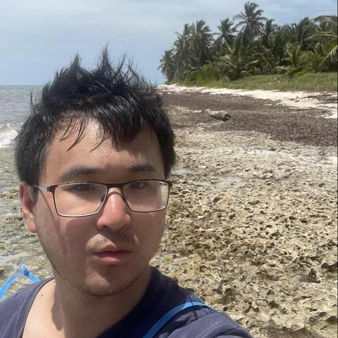{fig-alt="Photo of Alex Zhao"}](#azhao)

[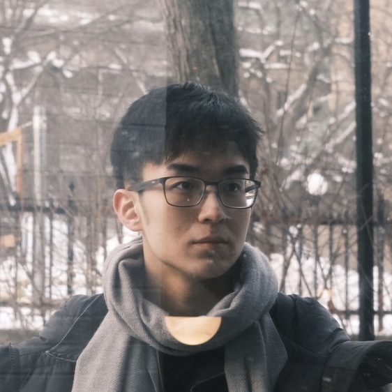{fig-alt="Photo of Evan Jiang"}](#evan)

[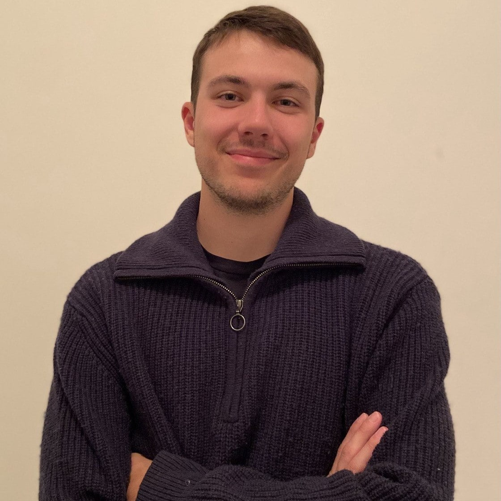{fig-alt="Photo of Isidore Victorri"}](#isidore)

[{fig-alt="Photo of Maya Aderka"}](#maya)

[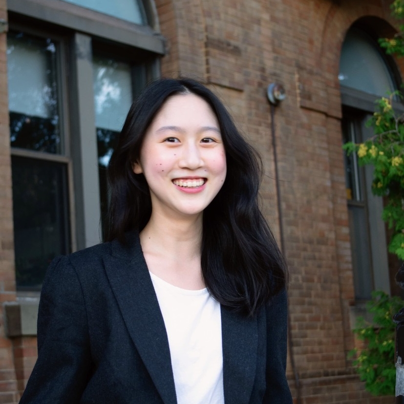{fig-alt="Photo of Sabrina Du"}](#sabrina)

[{fig-alt="Photo of Anna Rose Hunt-Isaak"}](#annarose)

[{fig-alt="Photo of Yiqing Zhu"}](#Yiqing)


:::

### Collaborators

::: {#members layout-ncol="5"}
[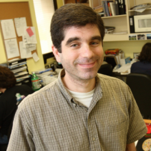{fig-alt="Photo of Chris"}](https://www.mcgill.ca/neuro/christopher-pack-phd)

[{fig-alt="Photo of Emmanuel"}](https://www.janelia.org/people/ifedayo-emmanuel-adeyefa-olasupo)

[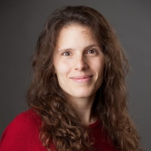{fig-alt="Photo of Catherine"}](https://www.mcgill.ca/sis/people/faculty/guastavino)

[{fig-alt="Photo of Fabrice"}](https://www.mcgill.ca/music/fabrice-marandola)

[{fig-alt="Photo of Simone"}](https://brams.org/members/simone-dalla-bella/)

[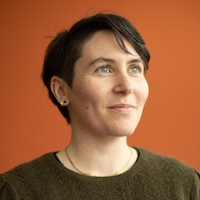{fig-alt="Photo of Audrey"}](https://audur2.ift.ulaval.ca/)

[{fig-alt="Photo of Dang Nguyen"}](https://neurosciences.umontreal.ca/recherche/les-chercheurs/dang-khoa-nguyen/)

[{fig-alt="Photo de Pauline"}](https://www.pauline-patie.com/)

[{fig-alt="Photo of MH"}](https://www.mcgill.ca/spot/marie-helene-boudrias)

[{fig-alt="Photo de Joshua"}](https://www.linkedin.com/in/joshua-rosner-98b15b166/?originalSubdomain=ca)

::: 

------------------------------------------------------------------------

<a name="suresh"></a>

#### Suresh Krishna

::: column-margin
{fig-alt="Photo of Suresh Krishna" width="200"}
:::

-   Associate Professor, Department of Physiology, McGill.

-   MBBS (Med School), AIIMS, New Delhi; PhD, NYU, New York.

-   Spent time at Columbia University, CNRS (Lyon), German Primate Center (Goettingen), MPI for Human Development (Berlin), before coming to McGill (Jan 2020).

-   [Email](mailto:suresh.krishna@mcgill.ca); [Google Scholar]( Google Scholar - https://tinyurl.com/ypeu5ha3)

------------------------------------------------------------------------

<a name="kasia"></a>

#### Katarzyna (Kasia) Jurewicz

::: column-margin
{fig-alt="Photo of Katarzyna (Kasia) Jurewicz" width="200"}
:::

-   Post-doctoral fellow, Department of Physiology, McGill.

-   MSc in Psychology, University of Warsaw; PhD in Neurobiology, Nencki Institute of Experimental Biology, Polish Academy of Sciences, Warsaw.

-   Previously, I was a post-doc in Dr. Becket Ebitz' lab (Noise lab) at Université de Montréal. Earlier, I conducted research in Dr. Ewa Kublik's Cortico-Thalamic Group at the Nencki Institute of Experimental Biology. My PhD work was supervised by Prof. Andrzej Wróbel in the Laboratory of the Visual System at Nencki.

-   [Email](mailto:katarzyna.jurewicz@mail.mcgill.ca); [Google Scholar]( http://www.tinyurl.com/kjurewicz-scholar)

------------------------------------------------------------------------

<a name="yohai"></a>

#### Yohai-Eliel Berreby

::: column-margin
{fig-alt="Photo of Yohai-Eliel Berreby" width="200"}
:::

-   Ph.D. student, Department of Physiology, McGill

-   Diplôme d'Ingénieur (combined B.Sc. and M.Sc. in Engineering), Télécom Paris, Palaiseau, France

-   MPSI/MP CPGE (Math/Physics [*Classes Préparatoires aux Grandes Écoles*](https://en.wikipedia.org/wiki/Classe_pr%C3%A9paratoire_aux_grandes_%C3%A9coles)), Lycée Hoche, Versailles, France

-   [Email](mailto:yohai-eliel.berreby@mail.mcgill.ca); [GitHub]( https://github.com/yberreby/); [LinkedIn]( https://linkedin.com/in/yberreby)

------------------------------------------------------------------------

<a name="oren"></a>

#### Oren Gurevitch

::: column-margin
{fig-alt="Photo of Oren Gurevitch" width="200"}
:::

-   M.Sc. Student, Department of Physiology, McGill.

-   B.Sc. in Neuroscience, Bar-Ilan University, Ramat Gan, Israel.

-   Previously, I was a research assistant working on sensory processing using rats, at Bar-Ilan University under Professor Adam Zaidel. Before that, as a lab assistant at the Weizmann Institute of Science, I worked on Multiple Sclerosis research with Professor Idit Shachar.

-   [Email](mailto:oren.gurevitch@mail.mcgill.ca); [GitHub]( https://github.com/OrenGurevitch); [LinkedIn]( https://www.linkedin.com/in/oren-gurevitch/)

------------------------------------------------------------------------

<a name="buxin"></a>

#### Buxin Liao

::: column-margin
{fig-alt="Photo of Buxin Liao" width="200"}
:::

-   Ph.D. Student, Integrated Program in Neuroscience, McGill.

-   M.Eng. Student, Biomedical Engineering, University of Electronic Science and Technology of China, Chengdu, China.

-   B.Eng. in Biomedical Engineering, Southeast University, Nanjing, China.

-   [Email](mailto:buxin.liao@mail.mcgill.ca); [GitHub]( https://github.com/D-Fonauton)

------------------------------------------------------------------------

<a name="noa"></a>

#### Noa Kemp

::: column-margin
{fig-alt="Photo of Noa Kemp" width="200"}
:::

-   M.Sc. Student, Department of Physiology, McGill.

-   B.Sc. in Biology and Computer Science, McGill.

-   Between musical theater, computer science and the brain - I wasn’t able to chose so I will focus on one of their intersections: the study of audiovisual space and object perception.

-   I was born and raised in Belgium. However half of my family lives in Israel and I have spent most of my summers there. Today, the place I truly call home is definitely Montreal.

-   [Email](mailto:noa.kemp@mail.mcgill.ca)

------------------------------------------------------------------------

<a name="jacky"></a>

#### Jacky Chen

::: column-margin
{fig-alt="Photo of Jacky Chen" width="200"}
:::

-   B.A. in Psychology with double minors in Behavioral Science and Science for Art Students, McGill

-   As someone who enjoys playing the piano, I am curious to explore the ways cognitive processes impact musical expression and attentional shifts. My research interests lie at the intersection of psychology, music, and cognitive science.

-   I was born in Shanghai, China, where I spent the first 18 years of my life. After completing high school, I relocated to Montreal to pursue my studies at McGill University. I really enjoy the lovely summer in Montreal!

-   [Email](mailto:yijun.chen@mail.mcgill.ca)

------------------------------------------------------------------------

<a name="azhao"></a>

#### Alex Zhao

::: column-margin
{fig-alt="Photo of Alex Zhao" width="200"}
:::

-   B. Sc student, Neuroscience program, McGill

-   My research interests lie in computational neuroscience, as I believe that computational models have the power to capture the brain's inner workings. In my free time I enjoy reading and solo traveling.

-   [Email](mailto:alex.zhao@mail.mcgill.ca)

------------------------------------------------------------------------

<a name="evan"></a>

#### Evan Jiang

::: column-margin
{fig-alt="Photo of Evan Jiang" width="200"}
:::

-   B. Sc student, Major Computer Science and Biology, Mcgill

-   I initially started in the life science program but developed a strong interest in programming, which led me to combine these interests by switching to a major in computer science and biology. My research interests now lie in computational biology, with a particular focus on neurology.

-   [Email](mailto:duoduo.jiang@mail.mcgill.ca)

------------------------------------------------------------------------

<a name="isidore"></a>

#### Isidore Victorri

::: column-margin
{fig-alt="Photo of Isidore Victorri" width="200"}
:::

-   B.Sc. Student in Physiology and Physics, McGill.

-   With a bachelor’s program focused on research, I'm eager to dive into the field of auditory attention.

-   Originally from Saint-Pierre-et-Miquelon, a small French overseas territory, now experiencing life in a big city for the first time while studying in Montréal.

-   [Email](mailto:isidore.victorri@mail.mcgill.ca)

------------------------------------------------------------------------

<a name="maya"></a>

#### Maya Aderka

::: column-margin
{fig-alt="Photo of Maya Aderka" width="200"}
:::

-   M.Sc. Student, Department of Physiology, McGill.

-   B.Sc. in Psychology and Computer Science with an emphasis on Neuroscience, Tel Aviv University, Tel Aviv, Israel.

-   During mt B.Sc, I worked as a research assistant in Prof. Nitzan Censor lab, which studies memory and learning. I assisted in conducting behavioral studies, as well as studies involving EEG, fMRI and TMS.

-   In the final year of my B.Sc, I joined Prof. Yuval Nir's sleep lab to help with an initiative to create SleepEEGpy, a platform to pre-process and analyse sleep EEG data.

-   [Email](mailto:maya.aderka@mail.mcgill.ca); [GitHub]( https://github.com/maya-a); [LinkedIn]( https://www.linkedin.com/in/maya-aderka-703b08229/)

------------------------------------------------------------------------

<a name="sabrina"></a>

#### Sabrina Du

::: column-margin
{fig-alt="Photo of Sabrina Du" width="200"}
:::

-   B. Sc. Student, Honours Neuroscience, McGill.

-   Born and raised in Montreal, I grew up alongside this city’s rise as an AI hub and developed a keen interest in brain-inspired computational architectures.

-   How does short-term perceptual memory guide decisions? Can we replicate this memory system in artificial networks? These questions (and more) are ones I am excited to explore.

-   In my free time, you can find me listening to a podcast, hiking, or attempting to sew.

-   [Email](mailto:sabrina.du@mail.mcgill.ca)

------------------------------------------------------------------------

<a name="annarose"></a>

#### Anna Rose Hunt-Isaak

::: column-margin
{fig-alt="Photo of Anna Rose Hunt-Isaak" width="200"}
:::

-   BASc Honors Cognitive Science, McGill

-   I’m interested in exploring the intersection of neuroscience and computer science, especially with regards to how we can computationally model cognitive processing and develop a better understanding of how neural activity mediates observable behaviors.

-   My hobbies include baking, reading George Saunders, and layering poorly for winter runs

-   [Email](mailto:anna.hunt-isaak@mail.mcgill.ca)

------------------------------------------------------------------------

<a name="Yiqing"></a>

#### Yiqing Zhu

::: column-margin
{fig-alt="Photo of Yiqing Zhu" width="200"}
:::

-   Non-thesis M.Sc student, Computer Science, McGill.

-   I have graduated from McGill University with a B.Sc. Honours in Computer Science and a minor in Statistics. During my undergraduate studies, I conducted interdisciplinary research at the intersection of biology, neuroscience, and computation. I'm now pursuing graduate studies with a focus on ML, AI, and the contribution of large language models to data research.

-   [Email](mailto:yiqing.zhu2@mail.mcgill.ca)

------------------------------------------------------------------------


### Where we are from

<span style="color:#FF3030;">Current</span> /  <span style="color:orange;">Past</span>

```{r,message=FALSE,warning=FALSE}

library(tmap)
library(sf)

data("World")

latlist <- c(8.561259, 30.605053, 32.08233, 43.6532, 53.13333, 43.70313, 48.831704, 30.0444, 41.084148, 37.0, 45.45778, 45.56583, 50.848383801134766, 45.5019, 33.88534, 32.3274, 14.6584, 32.4279, 37.8706, 50.6, 45.25, 48.84674234948124, 31.2304, 41.9001, 31.311206, 60.29335, 45.3, 19.00437473941976, 19.1911, 30.605053, 30.605053, 31.9796, 46.8852, 32.119023, 45.5019, 33.5138, 40.022709, 45.5103643)


lonlist <- c(76.874224, 104.074123, 34.881787, -79.3832, 23.16433, 7.26608, 1.609642, 31.2357, 29.03546, 3.0, -73.88489, -73.31437, 4.350009489440508, -73.567, 35.5115, 50.865, 100.3947, 53.688, 112.5486, 3.0, 5.75, 2.3724100000000004, 121.4737, -71.0898, 75.584556, 25.03784, -73.33, 72.85023541069054, 72.856, 104.074123, 104.074123, 120.8937, -56.3159, 34.819675, -73.5674, 36.2765, -75.320869, -73.5746522)

namezlist <- c("suresh", "Haoxiang", "oren", "amanda", "kasia", "Anais", "yohai", "Injy", "Yavuz", "Lilia", "Alexandru", "Youzhi", "noa", "Bradley", "Sarah", "Pegah", "Divi", "Romina", "Sizhuo", "Lilie", "jerome", "Louis", "jacky", "alexparent", "Yagya", "lian", "azhao", "dinesh", "dhruvanshu", "buxin", "xinning", "evan", "isidore", "maya", "sabrina", "taimaa", "annarose", "Yiqing")

nowies <- is.element(namezlist, c("suresh", "oren", "kasia", "yohai", "noa", "jacky", "azhao", "buxin", "evan", "isidore", "maya", "sabrina", "annarose", "Yiqing"))
oldies <- is.element(namezlist, c("Haoxiang", "amanda", "Anais", "Injy", "Yavuz", "Lilia", "Alexandru", "Youzhi", "Bradley", "Sarah", "Pegah", "Divi", "Romina", "Sizhuo", "Lilie", "jerome", "Louis", "alexparent", "Yagya", "lian", "dinesh", "dhruvanshu", "xinning", "taimaa"))

lat <- latlist[nowies]
lon <- lonlist[nowies]

latold <- latlist[oldies]
lonold <- lonlist[oldies]

geocode <- data.frame(lon,lat)
geocode2 <- st_as_sf(geocode, coords = c("lon", "lat"), crs = 4326)

ogeocode <- data.frame(lonold,latold)
ogeocode2 <- st_as_sf(ogeocode, coords = c("lonold", "latold"), crs = 4326)

# tm_shape(World) +
#     tm_fill("lightblue",alpha=1,minimize=TRUE) +
#   tm_layout(bg.color = "black") +
# tm_shape(geocode2) +      # dots shape
#   tm_dots(col = "red", size = .2)

usesize<-2

tm_shape(World)+
  tm_fill(col='darkslategray2')+
  tm_borders(col="black")+
  tm_layout(
    scale = 0.5,
    bg.color = "dodgerblue4",
    inner.margins = c(0.0005, 0.0005, 0.0005, 0.0005)  # bottom, left, top, right
  )+
  tm_shape(ogeocode2)+
  tm_dots(size = usesize, col = "orange", fill="orange")+
  tm_shape(geocode2)+
  tm_dots(size = usesize, col = "firebrick1", fill="firebrick1")+
     tm_credits("Réalisée avec tmap",
             position = c("RIGHT", "BOTTOM"))
```

### Alumni

*	Masters
    + Amanda Pruss (2025), IPN
    + Xinning Le (2025), IPN
	+ Haoxiang Liu (2024), IPN	
	+ Buxin Liao (2024), IPN
*   PHGY 396 - Sean Solomon, Sarah Beydoun, Pegah Aghili
*   COMP 401 - Nevine Nzabonimpa
* 	COGS 401/444 - Injy Fouda, Romina Niksirat
*	PSYC 385/395 - Anais Rubsamen, Alex Parent 
*   PSYC 494 - Youzhi Huang
*   NSCI 410 - Alexandru Tecu, Lilia Fernane
*   Mackey-Glass research bursary - Tim Yang
*   Undergraduate observers - Caden Welch, Max Tweedale, Elisa Niunin, Yavuz Shahzad, Divi Maheshwari, Lilie Jeanneaux, Yagya Joshi, Bradley Austin-Keiller, Lian Mouwes
*   Google Summer of Code interns - Dinesh Sathiaraj, Ioannis Valasakis, Prakanshul Saxena, Abhinav Venkatadri, Somnath Sharma, Jyothi Swaroop Reddy Bommareddy, Soham Mulye, Louis Martinez, Armaan Alam, Dinakar Chennupati, Dhruvanshu Joshi

--------------------------------------------------

### Us

::: {#photos layout-ncol="2"}

{fig-alt="lab1"}

{fig-alt="lab2"}

{fig-alt="lab2"}

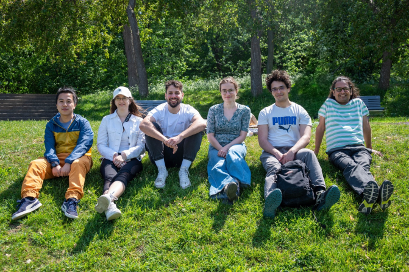{fig-alt="lab2"}

{fig-alt="labgath"}

{fig-alt="labgath"}

:::

