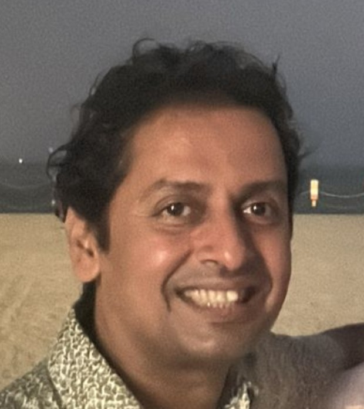
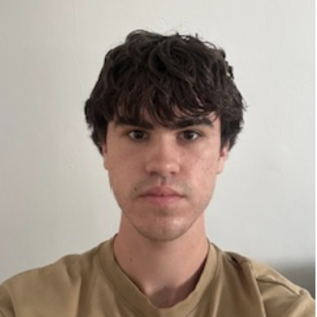
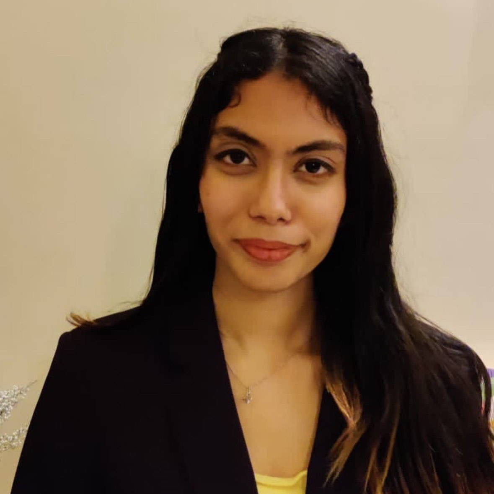
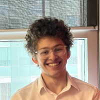
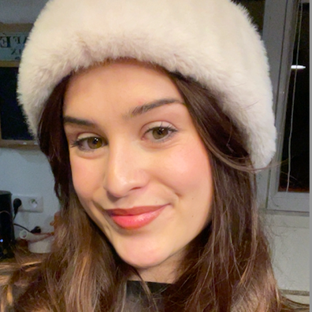
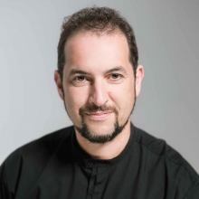
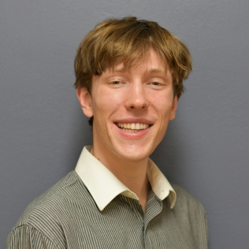

---
title: "Members"
description: |
lang: en  

output:
  distill::distill_article:
    self_contained: false
    toc: true
    toc_depth: 3
    
execute:
  echo: false
  freeze: auto
knitr:
  opts_chunk: 
    collapse: true
    results: false
    warnings: false
---

### Current Lab Members

<!--
::: column-margin
Marty's image is from the [McGill Tribune](https://tinyurl.com/55wf3bae).
:::
-->

::: {#members layout-ncol="6"}
[{fig-alt="Photo of Suresh Krishna"}](#suresh)

[{fig-alt="Photo of Yohai-Eliel Berreby"}](#yohai)

[{fig-alt="Photo of Buxin Liao"}](#buxin)

[{fig-alt="Photo of Maya Aderka"}](#maya)

[{fig-alt="Photo of Alex Zhao"}](#azhao)

[{fig-alt="Photo of Jacky Chen"}](#jacky)

[{fig-alt="Photo of Eliot Mudry Danisch"}](#Eliot)

[{fig-alt="Photo of Samantha Rogers"}](#Sammy)

[{fig-alt="Photo of Tanya Kumar"}](#Tanya)

[{fig-alt="Photo of Manuel Hanna"}](#Manuel)

[{fig-alt="Photo of Eva Ozturk"}](#Eva)


:::

### Collaborators

::: {#members layout-ncol="5"}
[{fig-alt="Photo of Chris"}](https://www.mcgill.ca/neuro/christopher-pack-phd)

[{fig-alt="Photo of Emmanuel"}](https://www.janelia.org/people/ifedayo-emmanuel-adeyefa-olasupo)

[{fig-alt="Photo of Catherine"}](https://www.mcgill.ca/sis/people/faculty/guastavino)

[{fig-alt="Photo of Fabrice"}](https://www.mcgill.ca/music/fabrice-marandola)

[{fig-alt="Photo of Simone"}](https://brams.org/members/simone-dalla-bella/)

[{fig-alt="Photo of Audrey"}](https://audur2.ift.ulaval.ca/)

[{fig-alt="Photo of Dang Nguyen"}](https://neurosciences.umontreal.ca/recherche/les-chercheurs/dang-khoa-nguyen/)

[{fig-alt="Photo of Marcelo"}](https://www.mcgill.ca/music/marcelo-m-wanderley)

[{fig-alt="Photo of MH"}](https://www.mcgill.ca/spot/marie-helene-boudrias)

[{fig-alt="Photo de Joshua"}](https://www.linkedin.com/in/joshua-rosner-98b15b166/?originalSubdomain=ca)

[{fig-alt="Photo of Jonathan"}](https://www.linkedin.com/in/jonathan-morris-5b841a283/)

[{fig-alt="Photo of Deepansh"}](https://www.linkedin.com/in/deepanshgl)

[{fig-alt="Photo of Alison"}](https://www.linkedin.com/in/-jiaxi-wang/)

[{fig-alt="Photo of Oren"}](https://www.linkedin.com/in/oren-gurevitch/)

[{fig-alt="Photo of Kasia"}](http://www.tinyurl.com/kjurewicz-scholar)

::: 

------------------------------------------------------------------------

<a name="suresh"></a>

#### Suresh Krishna

::: column-margin
{fig-alt="Photo of Suresh Krishna" width="200"}
:::

-   Associate Professor, Department of Physiology, McGill.

-   MBBS (Med School), AIIMS, New Delhi; PhD, NYU, New York.

-   Spent time at Columbia University, CNRS (Lyon), German Primate Center (Goettingen), MPI for Human Development (Berlin), before coming to McGill (Jan 2020).

-   [Email](mailto:suresh.krishna@mcgill.ca); [Google Scholar](https://tinyurl.com/ypeu5ha3)

------------------------------------------------------------------------

<a name="yohai"></a>

#### Yohai-Eliel Berreby

::: column-margin
{fig-alt="Photo of Yohai-Eliel Berreby" width="200"}
:::

-   Ph.D. student, Department of Physiology, McGill

-   Diplôme d'Ingénieur (combined B.Sc. and M.Sc. in Engineering), Télécom Paris, Palaiseau, France

-   MPSI/MP CPGE (Math/Physics [*Classes Préparatoires aux Grandes Écoles*](https://en.wikipedia.org/wiki/Classe_pr%C3%A9paratoire_aux_grandes_%C3%A9coles)), Lycée Hoche, Versailles, France

-   [Email](mailto:yohai-eliel.berreby@mail.mcgill.ca); [GitHub]( https://github.com/yberreby/); [LinkedIn]( https://linkedin.com/in/yberreby)

------------------------------------------------------------------------

<a name="buxin"></a>

#### Buxin Liao

::: column-margin
{fig-alt="Photo of Buxin Liao" width="200"}
:::

-   Ph.D. Student, Integrated Program in Neuroscience, McGill.

-   M.Eng. Student, Biomedical Engineering, University of Electronic Science and Technology of China, Chengdu, China.

-   B.Eng. in Biomedical Engineering, Southeast University, Nanjing, China.

-   [Email](mailto:buxin.liao@mail.mcgill.ca); [GitHub]( https://github.com/D-Fonauton)

------------------------------------------------------------------------

<a name="maya"></a>

#### Maya Aderka

::: column-margin
{fig-alt="Photo of Maya Aderka" width="200"}
:::

-   M.Sc. Student, Department of Physiology, McGill.

-   B.Sc. in Psychology and Computer Science with an emphasis on Neuroscience, Tel Aviv University, Tel Aviv, Israel.

-   During my B.Sc, I worked as a research assistant in Prof. Nitzan Censor lab, which studies memory and learning. I assisted in conducting behavioral studies, as well as studies involving EEG, fMRI and TMS.

-   In the final year of my B.Sc, I joined Prof. Yuval Nir's sleep lab to help with an initiative to create SleepEEGpy, a platform to pre-process and analyse sleep EEG data.

-   [Email](mailto:maya.aderka@mail.mcgill.ca); [GitHub]( https://github.com/maya-a); [LinkedIn]( https://www.linkedin.com/in/maya-aderka-703b08229/)

------------------------------------------------------------------------

<a name="azhao"></a>

#### Alex Zhao

::: column-margin
{fig-alt="Photo of Alex Zhao" width="200"}
:::

-   B. Sc student, Neuroscience program, McGill

-   My research interests lie in computational neuroscience, as I believe that computational models have the power to capture the brain's inner workings. In my free time I enjoy reading and solo traveling.

-   [Email](mailto:alex.zhao@mail.mcgill.ca)

------------------------------------------------------------------------

<a name="jacky"></a>

#### Jacky Chen

::: column-margin
{fig-alt="Photo of Jacky Chen" width="200"}
:::

-   B.A. in Psychology with double minors in Behavioral Science and Science for Art Students, McGill

-   As someone who enjoys playing the piano, I am curious to explore the ways cognitive processes impact musical expression and attentional shifts. My research interests lie at the intersection of psychology, music, and cognitive science.

-   I was born in Shanghai, China, where I spent the first 18 years of my life. After completing high school, I relocated to Montreal to pursue my studies at McGill University. I really enjoy the lovely summer in Montreal!

-   [Email](mailto:yijun.chen@mail.mcgill.ca)

------------------------------------------------------------------------

<a name="Eliot"></a>

#### Eliot Mudry Danisch

::: column-margin
{fig-alt="Photo of Eliot Mudry Danisch" width="200"}
:::

-   B.A. student in joint honours philosophy and political science with a minor in science for arts students, McGill

-   I’m interested in philosophy of mind and the intersection of philosophy and cognitive science. More specifically, I’m interested in the neural basis of consciousness, cognition, and perception in both humans and AI.

-   [Email](mailto:eliot.mudrydanisch@mail.mcgill.ca)

------------------------------------------------------------------------

<a name="Sammy"></a>

#### Samantha Rogers

::: column-margin
{fig-alt="Photo of Samantha Rogers" width="200"}
:::

-   B. Sc. Neuroscience, McGill University

-   I am originally from California and recently spent a semester studying at the University of Edinburgh. I am interested in exploring the connection between neurophysiology and behavior, in particular cognition, memory, and decision making. I hope to be able to learn more about the neural basis of human behavior.

-   [Email](mailto:samantha.rogers2@mail.mcgill.ca)

------------------------------------------------------------------------

<a name="Tanya"></a>

#### Tanya Kumar

::: column-margin
{fig-alt="Photo of Tanya Kumar" width="200"}
:::

-   Non-Thesis MSc, Computer Science, McGill BTech, Computer Science and Engineering, SRM University, Chennai, India

-   I'm interested in exploring psychology and neuroscience concepts through machine learning techniques.

-   [Email](mailto:tanya.kumar@mail.mcgill.ca)

------------------------------------------------------------------------

<a name="Manuel"></a>

#### Manuel Hanna

::: column-margin
{fig-alt="Photo of Manuel Hanna" width="200"}
:::

-   B.Eng. Student, Software Engineering (major) and Biomedical Engineering (minor), McGill.

-   As a Software Engineering student I started my minor in Biomedical Engineering last year with the goal of studying neural systems. I'm interested in using computational modeling to help improve understanding of processes such as attention and motor learning.

-   I enjoy playing soccer in my free time.

-   [Email](mailto:manuel.hanna@mail.mcgill.ca)

------------------------------------------------------------------------

<a name="Eva"></a>

#### Eva Ozturk

::: column-margin
{fig-alt="Photo of Eva Ozturk" width="200"}
:::

-   Graduate research trainee (McGill), Master student, Biomedical Engineering - Neurotechnology, Université Paris Cité / Arts et Métiers.

-   I have a double degree in Biomedical sciences and Psychology from Université Paris Cité, and I did an Erasmus at Imperial College London and internships at ENS (Paris) and EPFL (Geneva).

-   I am interested in developing tools at the interface between engineering and neuroscience, such as BCI or neuroprosthetics. I aim to translate neuroscientific knowledge into clinically relevant technologies

-   [Email](mailto:eva.ozturk@mail.mcgill.ca)

------------------------------------------------------------------------


### Where we are from

<span style="color:#FF3030;">Current</span> /  <span style="color:orange;">Past</span>

```{r,message=FALSE,warning=FALSE}

library(tmap)
library(sf)

data("World")

latlist <- c(8.561259, 30.605053, 32.08233, 43.6532, 53.13333, 43.70313, 48.831704, 30.0444, 41.084148, 37.0, 45.45778, 45.56583, 50.848383801134766, 45.5019, 33.88534, 32.3274, 14.6584, 32.4279, 37.8706, 50.6, 45.25, 48.84674234948124, 31.2304, 41.9001, 31.311206, 60.29335, 45.3, 19.00437473941976, 19.1911, 30.605053, 32.119023, 30.605053, 31.9796, 46.8852, 45.5019, 33.5138, 40.022709, 45.5103643, 45.5103643, 39.9042, 45.51, 31.8775, 31.8206, 28.7041, 24.4539, 43.0722, 36.0671, 29.166128, 43.6532, 37.832602, 19.076, 45.498163, 48.866667)


lonlist <- c(76.874224, 104.074123, 34.881787, -79.3832, 23.16433, 7.26608, 1.609642, 31.2357, 29.03546, 3.0, -73.88489, -73.31437, 4.350009489440508, -73.567, 35.5115, 50.865, 100.3947, 53.688, 112.5486, 3.0, 5.75, 2.3724100000000004, 121.4737, -71.0898, 75.584556, 25.03784, -73.33, 72.85023541069054, 72.856, 104.074123, 34.819675, 104.074123, 120.8937, -56.3159, -73.5674, 36.2765, -75.320869, -73.5746522, -73.5746522, -116.4074, -73.58, 120.5511, 117.2272, 77.1025, 54.3773, -89.40123, 120.3826, 120.055445, -79.3832, -122.210795, 72.8777, -73.585224, -2.333333)

namezlist <- c("suresh", "Haoxiang", "oren", "amanda", "kasia", "Anais", "yohai", "Injy", "Yavuz", "Lilia", "Alexandru", "Youzhi", "noa", "Bradley", "Sarah", "Pegah", "Divi", "Romina", "Sizhuo", "Lilie", "jerome", "Louis", "jacky", "alexparent", "Yagya", "lian", "azhao", "dinesh", "dhruvanshu", "buxin", "maya", "xinning", "evan", "isidore", "sabrina", "taimaa", "annarose", "Yiqing", "Yiqing", "Kevin", "Edward", "Claire", "Lihong", "Deepansh", "Rashed", "Jonathan", "Linjing", "Alison", "Eliot", "Sammy", "Tanya", "Manuel", "Eva")

nowies <- is.element(namezlist, c("suresh", "yohai", "jacky", "azhao", "buxin", "maya", "Eliot", "Sammy", "Tanya", "Manuel", "Eva"))
oldies <- is.element(namezlist, c("Haoxiang", "oren", "amanda", "kasia", "Anais", "Injy", "Yavuz", "Lilia", "Alexandru", "Youzhi", "noa", "Bradley", "Sarah", "Pegah", "Divi", "Romina", "Sizhuo", "Lilie", "jerome", "Louis", "alexparent", "Yagya", "lian", "dinesh", "dhruvanshu", "xinning", "evan", "isidore", "sabrina", "taimaa", "annarose", "Yiqing", "Yiqing", "Kevin", "Edward", "Claire", "Lihong", "Deepansh", "Rashed", "Jonathan", "Linjing", "Alison"))

lat <- latlist[nowies]
lon <- lonlist[nowies]

latold <- latlist[oldies]
lonold <- lonlist[oldies]

geocode <- data.frame(lon,lat)
geocode2 <- st_as_sf(geocode, coords = c("lon", "lat"), crs = 4326)

ogeocode <- data.frame(lonold,latold)
ogeocode2 <- st_as_sf(ogeocode, coords = c("lonold", "latold"), crs = 4326)

# tm_shape(World) +
#     tm_fill("lightblue",alpha=1,minimize=TRUE) +
#   tm_layout(bg.color = "black") +
# tm_shape(geocode2) +      # dots shape
#   tm_dots(col = "red", size = .2)

usesize<-1.0

tm_shape(World)+
  tm_fill(col='darkslategray2')+
  tm_borders(col="black")+
  tm_layout(
    scale = 0.5,
    bg.color = "dodgerblue4",
    inner.margins = c(0.0005, 0.0005, 0.0005, 0.0005)  # bottom, left, top, right
  )+
  tm_shape(ogeocode2)+
  tm_dots(size = usesize, col = "orange", fill="orange")+
  tm_shape(geocode2)+
  tm_dots(size = usesize, col = "firebrick1", fill="firebrick1")+
     tm_credits("Réalisée avec tmap",
             position = c("RIGHT", "BOTTOM"))
```

### Alumni

* Post-doctoral fellow - Katarzyna Jurewicz
* Masters 
    + Amanda Pruss (2025), IPN
    + Xinning Le (2025), IPN
	+ Haoxiang Liu (2024), IPN
	+ Buxin Liao (2024), IPN
    + Oren Gurevitch (2025), Physiology
    + Noa Kemp (2025), Physiology
*   PHGY 396 - Sean Solomon, Sarah Beydoun, Pegah Aghili, Jacky Chen
*   PHGY 461 - Isidore Victorri
*   COMP 401 - Nevine Nzabonimpa, Evan Jiang
*   COMP 396 - Evan Jiang
* 	COGS 401/444 - Injy Fouda, Romina Niksirat, Anna Rose Hunt-Isaak
*	PSYC 385/395 - Anais Rubsamen, Alex Parent
*   PSYC 494 - Youzhi Huang, Jacky Chen
*   NSCI 410 - Alexandru Tecu, Lilia Fernane, Alex Zhao 
*   Mackey-Glass Fellowship -- Tim Yang
*   CDSI Summer Research Fellow - Yiqing Zhu
*   Volunteer Researcher - Claire Yang, Edward Tong
*   McGill-UAE summer internship - Rashed Alhosani
*   MITACS Globalink Interns - Linjing Wang, Jonathan Morris, Alison Jiaxi Wang
*   NSERC SURA - Sabrina Du
*   Summer interns - Evan Jiang, Yagya Joshi, Kevin (Yuze) Liu
*   Undergraduate observers - Caden Welch, Max Tweedale, Elisa Niunin, Yavuz Shahzad, Divi Maheshwari, Lilie Jeanneaux, Yagya Joshi, Bradley Austin-Keiller, Lian Mouwes
*   Interns (Google Summer of Code) - Dinesh Sathiaraj, Ioannis Valasakis, Prakanshul Saxena, Abhinav Venkatadri, Somnath Sharma, Jyothi Swaroop Reddy Bommareddy, Soham Mulye, Louis Martinez, Armaan Alam, Dinakar Chennupati, Dhruvanshu Joshi, Lihong Chen, Deepansh Goel, Mohd Faisal Ansari, Michael Lewis

--------------------------------------------------

### Us

::: {#photos layout-ncol="2"}

{fig-alt="lab1"}

{fig-alt="lab2"}

{fig-alt="lab2"}

{fig-alt="lab2"}

{fig-alt="labgath"}

{fig-alt="labgath"}

:::

