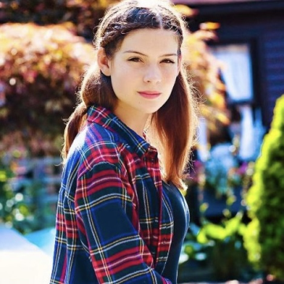

---
execute:
  echo: false
  freeze: auto
knitr:
  opts_chunk: 
    collapse: true
    results: false
    warnings: false
---

### Current Lab Members

::: column-margin
Marty's image is from the [McGill Tribune](https://tinyurl.com/55wf3bae).
:::

::: {#members layout-ncol="6"}
[{fig-alt="Photo of Suresh Krishna"}](#suresh)

[{fig-alt="Photo of Katarzyna (Kasia) Jurewicz"}](#kasia)

[{fig-alt="Photo of Jerome Carriot"}](#jerome)

[{fig-alt="Photo of Yohai-Eliel Berreby"}](#yohai)

[{fig-alt="Photo of Amanda Pruss"}](#amanda)

[{fig-alt="Photo of Oren Gurevitch"}](#oren)

[{fig-alt="Photo of Buxin Liao"}](#buxin)

[{fig-alt="Photo of Noa Kemp"}](#noa)

[{fig-alt="Photo of Xinning Le"}](#xinning)

[{fig-alt="Photo of Jacky Chen"}](#jacky)

[{fig-alt="Photo of Alex Parent"}](#alexparent)

[{fig-alt="Photo of Alex Zhao"}](#azhao)


:::

### Collaborators

::: {#members layout-ncol="5"}
[{fig-alt="Photo of Chris"}](https://www.mcgill.ca/neuro/christopher-pack-phd)

[{fig-alt="Photo of Emmanuel"}](https://www.janelia.org/people/ifedayo-emmanuel-adeyefa-olasupo)

[{fig-alt="Photo of Catherine"}](https://www.mcgill.ca/sis/people/faculty/guastavino)

[{fig-alt="Photo of Fabrice"}](https://www.mcgill.ca/music/fabrice-marandola)

[{fig-alt="Photo of Simone"}](https://brams.org/members/simone-dalla-bella/)

[{fig-alt="Photo of Hongmei"}](https://www.neuro.uestc.edu.cn/vccl/yhm.html)

[{fig-alt="Photo of Dang Nguyen"}](https://neurosciences.umontreal.ca/recherche/les-chercheurs/dang-khoa-nguyen/)

[{fig-alt="Photo de Pauline"}](https://www.pauline-patie.com/)

[{fig-alt="Photo of MH"}](https://www.mcgill.ca/spot/marie-helene-boudrias)

[{fig-alt="Photo de Joshua"}](https://www.linkedin.com/in/joshua-rosner-98b15b166/?originalSubdomain=ca)

::: 

------------------------------------------------------------------------

<a name="suresh"></a>

#### Suresh Krishna

::: column-margin
{fig-alt="Photo of Suresh Krishna" width="200"}
:::

-   Associate Professor, Department of Physiology, McGill.

-   MBBS (Med School), AIIMS, New Delhi; PhD, NYU, New York.

-   Spent time at Columbia University, CNRS (Lyon), German Primate Center (Goettingen), MPI for Human Development (Berlin), before coming to McGill (Jan 2020).

-   [Email](mailto:suresh.krishna@mcgill.ca); [Google Scholar]( Google Scholar - https://tinyurl.com/ypeu5ha3)

------------------------------------------------------------------------

<a name="kasia"></a>

#### Katarzyna (Kasia) Jurewicz

::: column-margin
{fig-alt="Photo of Katarzyna (Kasia) Jurewicz" width="200"}
:::

-   Post-doctoral fellow, Department of Physiology, McGill.

-   MSc in Psychology, University of Warsaw; PhD in Neurobiology, Nencki Institute of Experimental Biology, Polish Academy of Sciences, Warsaw.

-   Previously, I was a post-doc in Dr. Becket Ebitz' lab (Noise lab) at Université de Montréal. Earlier, I conducted research in Dr. Ewa Kublik's Cortico-Thalamic Group at the Nencki Institute of Experimental Biology. My PhD work was supervised by Prof. Andrzej Wróbel in the Laboratory of the Visual System at Nencki.

-   [Email](mailto:katarzyna.jurewicz@mail.mcgill.ca); [Google Scholar]( http://www.tinyurl.com/kjurewicz-scholar)

------------------------------------------------------------------------

<a name="jerome"></a>

#### Jerome Carriot

::: column-margin
{fig-alt="Photo of Jerome Carriot" width="200"}
:::

-   Research Associate, Department of Physiology, McGill.

-   PhD, Joseph Fourier University, Grenoble, France.

-   For the past two decades, I have been working on the vestibular system. I have held positions as a postdoctoral researcher and research associate at several institutions, including Brandeis University in Boston, the University of Western Ontario in London, and McGill University. My specialization lies in neural encoding of self-motion within the vestibular pathway.

-   [Email](mailto:Jerome.Carriot@mcgill.ca); [Google Scholar](https://scholar.google.ca/citations?hl=en&user=rEzMXEUAAAAJ); [ResearchGate]( https://www.researchgate.net/profile/Jerome-Carriot)

------------------------------------------------------------------------

<a name="yohai"></a>

#### Yohai-Eliel Berreby

::: column-margin
{fig-alt="Photo of Yohai-Eliel Berreby" width="200"}
:::

-   Ph.D. student, Department of Physiology, McGill

-   Diplôme d'Ingénieur (combined B.Sc. and M.Sc. in Engineering), Télécom Paris, Palaiseau, France

-   MPSI/MP CPGE (Math/Physics [*Classes Préparatoires aux Grandes Écoles*](https://en.wikipedia.org/wiki/Classe_pr%C3%A9paratoire_aux_grandes_%C3%A9coles)), Lycée Hoche, Versailles, France

-   [Email](mailto:yohai-eliel.berreby@mail.mcgill.ca); [GitHub]( https://github.com/yberreby/); [LinkedIn]( https://linkedin.com/in/yberreby)

------------------------------------------------------------------------

<a name="amanda"></a>

#### Amanda Pruss

::: column-margin
{fig-alt="Photo of Amanda Pruss" width="200"}
:::

-   M.Sc. Student, Integrated Program in Neuroscience, McGill.

-   B.A. in Psychology, McGill.

-   I am also very interested in applying my knowledge in neuroscience in a clinical setting as well, in an effort to help people with conditions related to vision, attention, or epilepsy.

-   [Email](mailto:amanda.pruss@mail.mcgill.ca); [GitHub]( https://github.com/amandapruss); [LinkedIn]( https://www.linkedin.com/in/amanda-pruss-a78813261/)

------------------------------------------------------------------------

<a name="oren"></a>

#### Oren Gurevitch

::: column-margin
{fig-alt="Photo of Oren Gurevitch" width="200"}
:::

-   M.Sc. Student, Department of Physiology, McGill.

-   B.Sc. in Neuroscience, Bar-Ilan University, Ramat Gan, Israel.

-   Previously, I was a research assistant working on sensory processing using rats, at Bar-Ilan University under Professor Adam Zaidel. Before that, as a lab assistant at the Weizmann Institute of Science, I worked on Multiple Sclerosis research with Professor Idit Shachar.

-   [Email](mailto:oren.gurevitch@mail.mcgill.ca); [GitHub]( https://github.com/OrenGurevitch); [LinkedIn]( https://www.linkedin.com/in/oren-gurevitch/)

------------------------------------------------------------------------

<a name="buxin"></a>

#### Buxin Liao

::: column-margin
{fig-alt="Photo of Buxin Liao" width="200"}
:::

-   Ph.D. Student, Integrated Program in Neuroscience, McGill.

-   M.Eng. Student, Biomedical Engineering, University of Electronic Science and Technology of China, Chengdu, China.

-   B.Eng. in Biomedical Engineering, Southeast University, Nanjing, China.

-   [Email](mailto:buxin.liao@mail.mcgill.ca); [GitHub]( https://github.com/D-Fonauton)

------------------------------------------------------------------------

<a name="noa"></a>

#### Noa Kemp

::: column-margin
{fig-alt="Photo of Noa Kemp" width="200"}
:::

-   M.Sc. Student, Department of Physiology, McGill.

-   B.Sc. in Biology and Computer Science, McGill.

-   Between musical theater, computer science and the brain - I wasn’t able to chose so I will focus on one of their intersections: the study of audiovisual space and object perception.

-   I was born and raised in Belgium. However half of my family lives in Israel and I have spent most of my summers there. Today, the place I truly call home is definitely Montreal.

-   [Email](mailto:noa.kemp@mail.mcgill.ca)

------------------------------------------------------------------------

<a name="xinning"></a>

#### Xinning Le

::: column-margin
{fig-alt="Photo of Xinning Le" width="200"}
:::

-   M.Sc. Student, Integrated Program in Neuroscience, McGill.

-   M.Eng. Student, Biomedical Engineering, University of Electronic Science and Technology of China, Chengdu, China.

-   B.Sc. in Information Security, Xi'an University of Posts and Telecommunication, Xian, China.

-   [Email](mailto:xinning.le@mail.mcgill.ca)

------------------------------------------------------------------------

<a name="jacky"></a>

#### Jacky Chen

::: column-margin
{fig-alt="Photo of Jacky Chen" width="200"}
:::

-   B.A. in Psychology with double minors in Behavioral Science and Science for Art Students, McGill

-   As someone who enjoys playing the piano, I am curious to explore the ways cognitive processes impact musical expression and attentional shifts. My research interests lie at the intersection of psychology, music, and cognitive science.

-   I was born in Shanghai, China, where I spent the first 18 years of my life. After completing high school, I relocated to Montreal to pursue my studies at McGill University. I really enjoy the lovely summer in Montreal!

-   [Email](mailto:yijun.chen@mail.mcgill.ca)

------------------------------------------------------------------------

<a name="alexparent"></a>

#### Alex Parent

::: column-margin
{fig-alt="Photo of Alex Parent" width="200"}
:::

-   BA Student, Department of Psychology, McGill University

-   As someone who plays seven instruments and is fascinated by neuroscience, I am fascinated by the interaction between music and the brain.

-   [Email](mailto:alexandra.parent@mail.mcgill.ca); [LinkedIn]( https://www.linkedin.com/in/alex-parent-82b456261)

------------------------------------------------------------------------

<a name="azhao"></a>

#### Alex Zhao

::: column-margin
{fig-alt="Photo of Alex Zhao" width="200"}
:::

-   B. Sc student, Neuroscience program, McGill

-   My research interests lie in computational neuroscience, as I believe that computational models have the power to capture the brain's inner workings. In my free time I enjoy reading and solo traveling.

-   [Email](mailto:alex.zhao@mail.mcgill.ca)

------------------------------------------------------------------------


### Where we are from

<span style="color:firebrick1;">Current</span> /  <span style="color:orange;">Past</span>

```{r,message=FALSE,warning=FALSE}
#| warning: false
library(tmap)
library(sf)

data("World")

latlist <- c(8.561259, 30.605053, 32.08233, 43.6532, 53.13333, 43.70313, 48.831704, 30.0444, 41.084148, 37.0, 45.45778, 45.56583, 50.848383801134766, 45.5019, 33.88534, 32.3274, 14.6584, 32.4279, 37.8706, 50.6, 45.25, 48.84674234948124, 31.2304, 41.9001, 31.311206, 60.29335, 45.3, 30.605053, 30.605053)

lonlist <- c(76.874224, 104.074123, 34.881787, -79.3832, 23.16433, 7.26608, 1.609642, 31.2357, 29.03546, 3.0, -73.88489, -73.31437, 4.350009489440508, -73.567, 35.5115, 50.865, 100.3947, 53.688, 112.5486, 3.0, 5.75, 2.3724100000000004, 121.4737, -71.0898, 75.584556, 25.03784, -73.33, 104.074123, 104.074123)

namezlist <- c("suresh", "Haoxiang", "oren", "amanda", "kasia", "Anais", "yohai", "Injy", "Yavuz", "Lilia", "Alexandru", "Youzhi", "noa", "Bradley", "Sarah", "Pegah", "Divi", "Romina", "Sizhuo", "Lilie", "jerome", "Louis", "jacky", "alexparent", "Yagya", "lian", "azhao", "buxin", "xinning")

nowies <- is.element(namezlist, c("suresh", "oren", "amanda", "kasia", "yohai", "noa", "jerome", "jacky", "alexparent", "azhao", "buxin", "xinning"))
oldies <- is.element(namezlist, c("Haoxiang", "Anais", "Injy", "Yavuz", "Lilia", "Alexandru", "Youzhi", "Bradley", "Sarah", "Pegah", "Divi", "Romina", "Sizhuo", "Lilie", "Louis", "Yagya", "lian"))

lat <- latlist[nowies]
lon <- lonlist[nowies]

latold <- latlist[oldies]
lonold <- lonlist[oldies]

geocode <- data.frame(lon,lat)
geocode2 <- st_as_sf(geocode, coords = c("lon", "lat"), crs = 4326)

ogeocode <- data.frame(lonold,latold)
ogeocode2 <- st_as_sf(ogeocode, coords = c("lonold", "latold"), crs = 4326)

# tm_shape(World) +
#     tm_fill("lightblue",alpha=1,minimize=TRUE) +
#   tm_layout(bg.color = "black") +
# tm_shape(geocode2) +      # dots shape
#   tm_dots(col = "red", size = .2)

usesize<-1

tm_shape(World)+
  tm_fill(col='darkslategray2')+
  tm_borders(col="black")+
  tm_layout(scale=0.5, bg.color="dodgerblue4",inner.margin=0.0005)+
  tm_shape(ogeocode2)+
  tm_dots(size = usesize, col = "orange")+
  tm_shape(geocode2)+
  tm_dots(size = usesize, col = "firebrick1")+
  tm_layout()+
     tm_credits("Réalisée avec tmap",
             position = c("RIGHT", "BOTTOM"))
```

### Alumni

*	Masters
	+ Haoxiang Liu (2024), IPN	
	+ Buxin Liao (2024), IPN
*   PHGY 396 - Sean Solomon, Sarah Beydoun, Pegah Aghili
*   COMP 401 - Nevine Nzabonimpa
* 	COGS 444 - Injy Fouda
*	PSYC 395 - Anais Rubsamen 
*   PSYC 494 - Youzhi Huang
*   NSCI 410 - Alexandru Tecu, Lilia Fernane
*   Mackey-Glass research bursary - Tim Yang
*   Undergraduate observers - Caden Welch, Max Tweedale, Elisa Niunin, Yavuz Shahzad, Divi Maheshwari, Lilie Jeanneaux, Yagya Joshi, Bradley Austin-Keiller, Lian Mouwes
*   Google Summer of Code interns - Dinesh Sathiaraj, Ioannis Valasakis, Prakanshul Saxena, Abhinav Venkatadri, Somnath Sharma, Jyothi Swaroop Reddy Bommareddy, Soham Mulye, Louis Martinez, Armaan Alam, Dinakar Chennupati, Dhruvanshu Joshi

--------------------------------------------------

### Us

::: {#photos layout-ncol="2"}

{fig-alt="lab1"}

{fig-alt="lab2"}

{fig-alt="lab2"}

{fig-alt="lab2"}

{fig-alt="labgath"}

{fig-alt="labgath"}

:::

