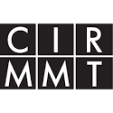
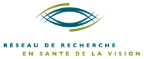
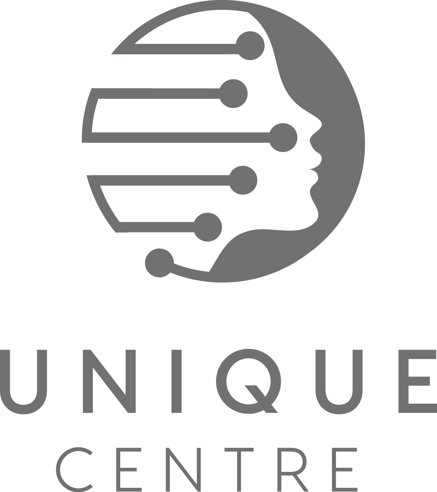

We work at the interface between the mind, brain, machines and the external world, using behavioral measurements (including eye-tracking), physiological measurements and computational modeling. We work with both humans and data from animal models, and much of our research focus is on vision, hearing, eye-movements, and brain-body interactions, including both sensory, attentional and cognitive aspects. We keep a keen eye on direct applications to devices, algorithms and human health.

We practice open science !

::: column-margin
Funding:

::: {#funding}
::: {layout-ncol="2"}
{fig-alt="NSERC logo"}

{fig-alt="McGill logo"}

{fig-alt="CIRMMT logo"}

{fig-alt="VHRN logo"}

{fig-alt="IVADO logo"}

{fig-alt="UNIQUE logo"}
:::
:::
:::

These are some of our ongoing projects (as of August 2025):

### Goal-directed vision, attentional dynamics and eye-movements

This is the primary (bread-and-butter) focus of the lab. We always have a large bag of potential projects with several running at any given time. 

We have a very strong interest in goal-directed active vision (where the eyes are freely moving). We combine modeling (with a variety of approaches), data analysis, psychophysics experiments and analysis of neurophysiological datasets from humans and monkeys. We are also very interested in predictive vision in general, and have a strong background and interest in visual attention and visuomotor behavior. Undergraduate research courses are usually, but not always, in this broad area, and involve a combination of psychophysics and data analysis/modeling. Buxin Liao is the technical lead.

We are also mostly focusing our ongoing efforts in "Neuro-AI" on this topic. We are developing and evaluating models of goal-directed vision that include various modern AI components (including deep convolutional neural networks and transformers) as components. Much of this work is led by Yohai-Eliel Berreby. 

### Hearing and sound

We are working on multiple projects involving visual and auditory localization, motion and objecthood. Our specific auditory interests include envelope process and sound motion, using behavioral and physiological data analysis and computational modeling.

### Phenomenological states and brain-heart-breathing interactions 

We have become very interested in the behavioral, physiological and neural correlates of self-reported subjectively experienced mental states. We have recently collected a large dataset from people experiencing musical absorption, and our preliminary findings indicate a similarity with certain forms of meditation but not others. This is an exploratory area for us but one we are actively working on. This work was led by Oren Gurevitch until he recently graduated from the lab with a Masters degree and started his PhD next door.

### Ageing

We have a new focus, with Alex Zhao as technical lead, on the impact of ageing on various brain and behavioral measures and their interactions with respiratory and cardiovascular measures. We are also collaborating Jonathan Morris, who did a summer Fulbright Canada - MITACS internship with us and with the MIDUS project at the University of Wisconsin-Madison.

### Epilepsy

With Maya Aderka as technical lead, and in collaboration with the epilepsy  unit at the CHUM, we are working on building tools to monitor and analyze intracranial EEG data in the context of epilepsy management. We also work on basic science projects in this context, making use of the invaluable opportunity to collect neural data from human brains during pre-surgical monitoring. 

In related work, in collaboration with neonatologists, we are also setting up to build (semi-)automated monitoring of neonatal encephalopathy and seizures, especially in the NICU.  

### Strabismus

Intermittent exotropia is most commonly a neural disorder of unknown origin. It is one of the most common forms of strabismus and intervention, which often fails, is usually done via "surgical fixes" that do not address the underlying problem. We are currently looking into visual perception and simple interventional possibilities in intermittent exotropes.

### Devices and applied work

We are very interested in a range of applied work, and generally pursue this with the support of the MITACS Globalink internship program and the Google Summer of Code. Some of our ongoing projects include:

* [Scicommons](https://scicommons.org) - a project that will soon be released in private journal-club mode, but hopes to expand into a portal for posting, reviewing and rating scholarly articles. Ongoing work with many people, with Armaan Alam as technical lead.

* GestureCap - we are building a markerless gesture-recognition and motion-capture Ml/AI-based tool to drive music and speech generation, and develop neuroscientific/psychological theories of music creativity and music-movement-dance interactions. At the moment, we are able to achieve a median 13 ms latency from gesture to sound output using a regular laptop. Technical report coming soon. Ongoing work with Deepansh Goel and Alison Wang.

* We have been working on projects to build open-source phone-based eye-trackers; this remains in progress. 

* We will soon release the first version of a cross-platform phone app that records breathing via a microphone and ECG via a Polar H10 belt and allows feedback-guided breathing protocols to be easily performed, recorded and tested. Ongoing work with Michael Lewis.